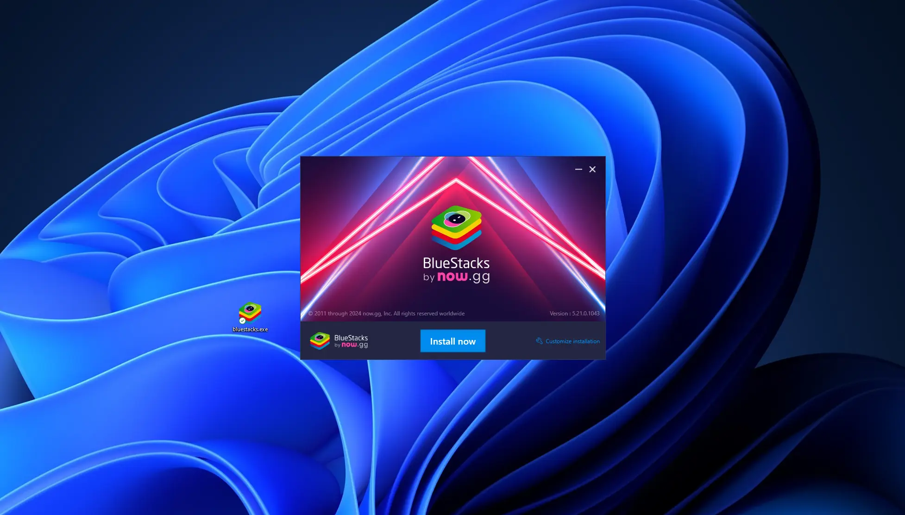
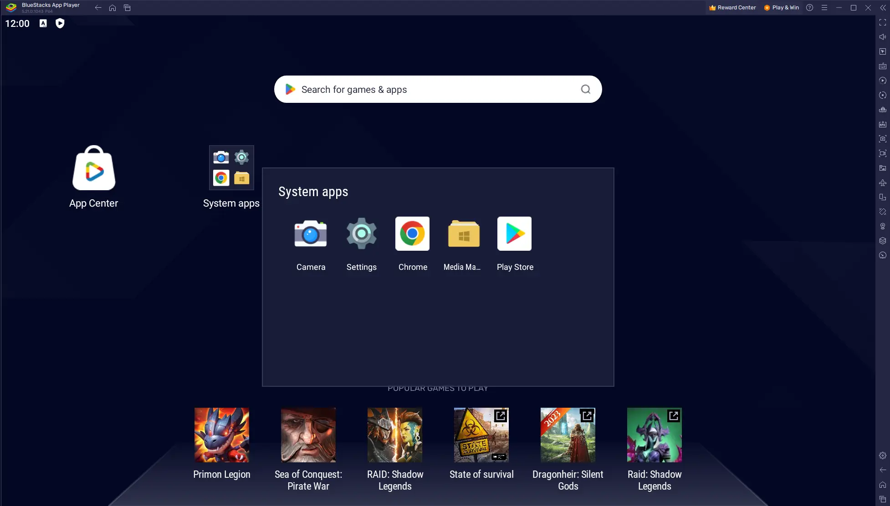

# LPS Manager x Bluestack

The LPS Manager app is designed to streamline the management of Lightning Protection Installations (LPS). With its user-friendly interface and comprehensive features, it simplifies tasks such as inventory management, inspection scheduling, and documentation. Through the app, users can easily track the status of installations, schedule maintenance, and generate reports, ensuring compliance with safety standards and regulations. By utilizing LPS Manager, organizations can enhance efficiency, reduce errors, and ensure the safety of their infrastructure against lightning strikes.

# Use via Bluestack

The LPS Manager app can also be seamlessly utilized through Bluestacks, a versatile platform that enables the emulation of Android applications on PC. By leveraging Bluestacks, users can experience several benefits when managing Lightning Protection Installations (LPS). This makes it simpler to oversee intricate details of installations and carry out tasks efficiently. Secondly, Bluestacks allows for precise control using a mouse and keyboard, facilitating smoother interaction with the LPS Manager interface. This precise control is particularly advantageous for tasks such as inputting data, scheduling inspections, and generating reports. Additionally, utilizing LPS Manager through Bluestacks enables seamless integration with other desktop applications, enhancing productivity and workflow management. Overall, leveraging Bluestacks to access the LPS Manager app enhances user experience, efficiency, and functionality, making it an invaluable tool for managing Lightning Protection Installations.

## Install Bluestack

Download bluestack from [this link](https://www.bluestacks.com/). You will then need to install the application on your Windows environment. 

## Set up your account

Open up the PlayStore application available out of the box directly inside Bluestack. You will need to register your Google Account.

## Download LPS Manager

Still inside the PlayStore application, search for the `LPS Manager` application and install it

## Open LPS Manager

Open the LPS Manager application and login into your account/register a new account. You will then be able to use your account just like you would be using it on your smartphone or tablet.

